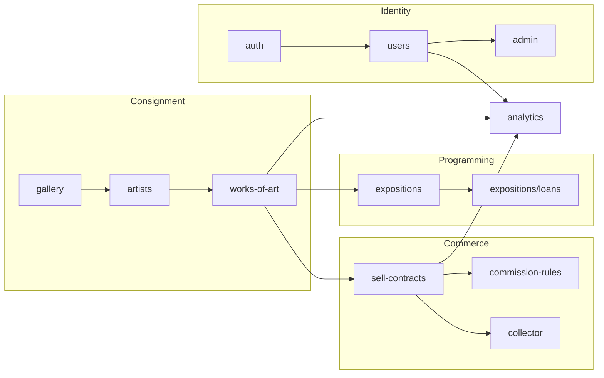

# ConsignArt

> B2B REST API for contemporary art galleries to manage artwork consignment: artists, galleries,
> sales with automatic commission tiers, exhibitions and inter-gallery loans.

- [1. Project description](#1-project-description)
- [2. Quick start (Docker)](#2-quick-start-docker)
- [3. Demo accounts](#3-demo-accounts)
- [4. Running locally without Docker](#4-running-locally-without-docker)
- [5. Tests](#5-tests)
- [6. Features implemented](#6-features-implemented)
- [7. Technical choices](#7-technical-choices)
- [8. Architecture](#8-architecture)
- [9. Known limitations / remaining work](#9-known-limitations--remaining-work)

## 1. Project description

A gallery takes an artwork on **consignment** from an artist, exhibits it and sells it on the
artist's behalf. The gallery keeps a commission on every sale and owes the remaining balance to
the artist. ConsignArt is the API behind that workflow: user accounts and roles, artist rosters,
artwork lifecycle (`available` → `on_loan` / `sold` / `returned`, with a full status history),
sales with tiered commission calculation run inside a database transaction, exhibitions and
inter-gallery loans, and reporting for galleries, artists and admins.

Built with **NestJS + TypeORM**, fully documented and testable through **Swagger**.

## 2. Quick start (Docker)

No manual setup is required - every environment variable has a working default baked into the
compose files below, so both commands work straight after cloning.

### Option A - development stack (SQLite, default)

```bash
docker compose up --build
```

- Boots the API with hot-reload (`nest start --watch`) against a local SQLite file
  (`./data/app.sqlite`, persisted via a bind mount).
- Automatically seeds a full demo dataset on first boot (idempotent - safe to restart), including
  the very first **admin** account (see [§3](#3-demo-accounts)): without this there would be no
  way to reach any admin-only endpoint on a fresh database, since only an existing admin can
  create another one.
- API: <http://localhost:3000/api/v1> · **Swagger UI: <http://localhost:3000/api/v1/docs>**

### Option B - production-like stack (PostgreSQL)

```bash
docker compose -f compose.prod.yml up --build
```

- Runs the multi-stage production image against a real PostgreSQL 17 container, applying
  TypeORM migrations (`npm run migration:run:prod`) before starting, then seeding the same demo
  dataset (also idempotent).
- Data persists in the named `data` Docker volume.
- Swagger UI: <http://localhost:3000/api/v1/docs>

Either way, drop an optional `.env` file next to the compose file you use (copy `.env.example`)
to override any default (`JWT_SECRET`, `DB_PASSWORD`, ports, ...); Compose picks it up
automatically.

### Using Swagger

1. Open <http://localhost:3000/api/v1/docs>.
2. Call `POST /auth/login` with one of the [demo accounts](#3-demo-accounts) (or `POST
   /auth/signup` to create a `collector`/`gallery` account of your own - `artist` and `admin`
   accounts can only be created by a gallery / an admin, never by public signup).
3. Copy `data.token.accessToken` from the response, click **Authorize** (top right) and paste it
   as `Bearer <token>`. Every protected endpoint is annotated so Swagger sends that header
   automatically from then on.

## 3. Demo accounts

Seeded automatically by `src/core/db/seeds/seed.ts` (password is the same for every account):

| Role      | Email                          | Notes                                  |
|-----------|---------------------------------|-----------------------------------------|
| admin     | `admin@consignart.test`         | can validate galleries, create admins  |
| gallery   | `gallery.a@consignart.test`     | validated, 4 artworks, 3 artists       |
| gallery   | `gallery.b@consignart.test`     | validated, borrows an artwork from A   |
| gallery   | `gallery.c@consignart.test`     | **pending** admin validation           |
| artist    | `artist.elena@consignart.test`  | attached to gallery A                  |
| artist    | `artist.marcus@consignart.test` | attached to gallery A                  |
| artist    | `artist.sofia@consignart.test`  | attached to gallery B                  |
| collector | `collector.1@consignart.test`   | bought "Quiet Horizon"                 |
| collector | `collector.2@consignart.test`   |                                         |

Password for all of the above: **`Password#2026`**

The dataset already includes one recorded sale (with computed commission), one exhibition and one
inter-gallery loan, so the reporting endpoints (`/analytics/*`) return non-empty results
immediately.

## 4. Running locally without Docker

```bash
npm install
cp .env.example .env.local        # NODE_ENV=development, DB_DRIVER=sqlite - fill in the values
npm run start:dev                 # http://localhost:3000/api/v1/docs
npm run seed                      # optional: same demo dataset as the Docker path
```

For a PostgreSQL run: create a `.env` (`NODE_ENV=production`, `DB_DRIVER=postgres`), then
`npm run build && npm run migration:run:prod && npm run start:prod`.

## 5. Tests

```bash
npm run test        # unit + integration suite (Jest)
npm run test:cov     # with coverage
```

41 tests across 8 suites, including:

- **Unit** - commission tiering (40/35/30%), sale creation (reserve price floor, `on_loan` block,
  gallery-ownership check, transactional invoice/receipt/history writes), exhibition creation
  (zero-artwork rejection, ownership, availability), loan creation (no double-loan, no self-loan),
  and the three `/analytics/*` aggregation services.
- **Integration** (`test/integrations`) - boots the real `AppModule` (all modules, providers, the
  actual global `ValidationPipe` / exception filter / response interceptor) against an isolated
  in-memory SQLite database and drives `POST /auth/signup` → `POST /auth/login` → `GET /auth/me`
  over HTTP with `supertest`, covering validation errors, duplicate emails, the
  admin-self-signup business rule, wrong credentials and the JWT guard.

## 6. Features implemented

### Users & authentication

- [x] Signup for collector / gallery / artist(via a gallery only) / admin (via an admin only)
- [x] An artist belongs to at most one gallery at a time
- [x] Passwords hashed with bcrypt
- [x] A gallery account must be validated by an admin before it can log in
- [x] JWT login (access + refresh token), refresh rotation & revocation
- [x] `GET /auth/me`

### Artists, artworks, sales, exhibitions & loans

- [x] Gallery-managed artist roster (bio, portfolio URL, nationality, status, join date)
- [x] Artist transfer between galleries, subject to admin approval
- [x] Artwork lifecycle: `available` / `on_loan` / `sold` / `returned`, with every status change
      written to `art_work_transfer_history_entity`
- [x] Max 50 active artworks per artist (enforced twice: `MaxActiveArtworksPipe` at the HTTP
      boundary, and again in `AddArtworkService` so the invariant holds for non-HTTP callers too,
      e.g. the seed script)
- [x] Sale blocked below the reserve price and while `on_loan`
- [x] Commission tiers (40% ≤ 5000€, 35% ≤ 20000€, 30% above), sale + invoice + receipt +
      history all written inside one DB transaction
- [x] Exhibitions (on-site or virtual), rejected if created with zero artworks; member artworks
      switch to `on_loan` for the duration
- [x] Inter-gallery loans, rejected if the artwork is already on loan or if lending to oneself

### Reporting

- [x] Gallery / artist / admin dashboards (`/analytics/*`)

### NestJS building blocks

- [x] 11 feature modules, each owning its controllers/services/entities/DTOs
- [x] Versioned REST routes under `/api/v1`
- [x] Global `ValidationPipe` (class-validator + class-transformer)
- [x] Custom pipes: `FrenchDatePipe` (business transformation - parses `DD/MM/YYYY` into a
      `Date`, used by `GET /sales?since=`) and `MaxActiveArtworksPipe` (business validation -
      request-scoped, enforces the 50-active-artworks-per-artist rule on
      `POST /artists/art-work`)
- [x] `JwtAccessGuard` / `JwtRefreshGuard` (global auth) + `RolesGuard`, a single
      `Reflector`-based guard reading the roles declared with `@Roles(...)` on each route
      (`ROLES_KEY` metadata, `reflector.getAllAndOverride`)
- [x] `OwnershipGuard` (a guard factory, same pattern as Passport's own `AuthGuard('jwt')`):
      checks the target art work belongs to the caller's gallery and/or the caller themself as
      its artist, admins always pass. Reads the art work id from a route param or a body field
      depending on how it's configured per route, and is applied on
      `PATCH/DELETE /artworks/:id`, `PATCH /artworks/:id/status` and `POST /sales`
- [x] Response-envelope interceptor (`{ success, data, timestamp }`) + request-logging
      interceptor (writes to `logs/requests.log`)
- [x] Global exception filter formatting every `HttpException` into one consistent error shape
- [x] TypeORM: `ManyToOne`/`OneToMany`/`ManyToMany` relations, transactions on every
      money-moving operation, migrations for the PostgreSQL schema, an index on
      `work_art_entity.status`
- [x] `@nestjs/config` with a `class-validator`-checked `EnvValidation` schema and a committed
      `.env.example`
- [x] Multi-stage `Dockerfile` (`node:22-alpine`) + two Compose files (dev/SQLite,
      prod/PostgreSQL), both startable with zero manual setup

See [§9](#9-known-limitations--remaining-work) for what is intentionally **not** done yet.

## 7. Technical choices

- **SQLite in dev / PostgreSQL in prod (via Docker), both through TypeORM.** SQLite needs no
  service and keeps `docker compose up --build` instant and dependency-free for local
  development and grading; PostgreSQL is what actually runs in the `compose.prod.yml` stack,
  matching the assignment's target deployment and exercising real migrations instead of
  `synchronize: true`.
- **JWT access + refresh, rotated and revocable.** Access tokens are short-lived; refresh tokens
  are stored hashed and rotated on every use so a stolen refresh token can be revoked.
- **Response envelope + a single global exception filter.** Every response (success or error)
  has the same predictable shape, which keeps API consumers (and this README's Swagger
  walkthrough) simple.

## 8. Architecture



Each box under `src/modules` is a self-contained NestJS module (controller + services + entities
+ DTOs); shared cross-cutting code (guards, pipes, filters, interceptors, env/TypeORM config)
lives in `src/core`, and code shared by more than one module (enums, base DTOs, the
`CreateUsersService` used by both signup and the seed script, ...) lives in `src/shared`.

## 9. Known limitations / remaining work

Honest list of what the assignment asks for and this codebase does not implement yet - useful
both for grading and as a to-do list:

- **No dedicated business-exception filter.** `GlobalExceptionsHandlerFilter` only catches
  `@Catch(HttpException)` - a non-`HttpException` error (a raw driver error, for instance) is not
  reformatted into the standard envelope. A `BusinessRuleViolation`-style filter, plus widening
  the global filter's `@Catch()` to also handle unexpected errors, are both still open.
- **No cache interceptor** on read-heavy public endpoints (explicitly optional in the brief).
- **Known bug:** two logins for the same account within the same second currently produce
  byte-identical JWTs, which collide on `refresh_tokens_entity.hashed_token`'s unique
  constraint. Add a random claim (e.g. a `jti`) to the JWT payload to fix it.
